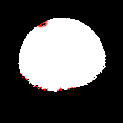
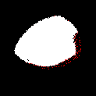
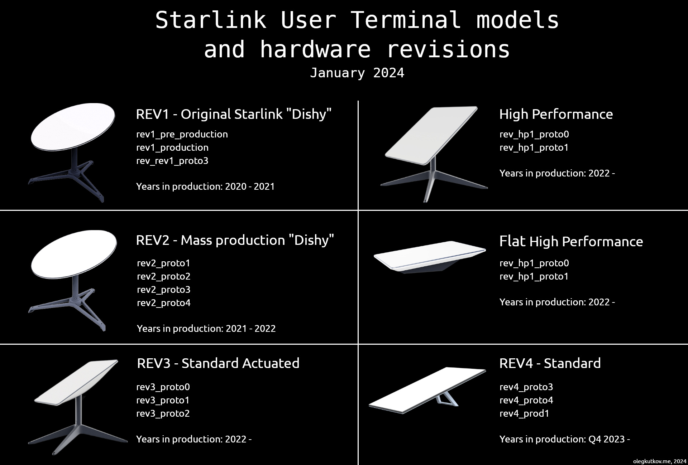

# LENS: A LEO Satellite Network Measurement Dataset

This repository contains the dataset for the paper ***[LENS: A LEO Satellite Network Measurement Dataset](https://dl.acm.org/doi/10.1145/3625468.3652170)*** published in ACM Multimedia Systems Conference (MMSys'24) Open-Source Software and Dataset (ODS) track.

The original dataset snapshot for the published paper can be found at commit [c084c11](https://github.com/clarkzjw/LENS/tree/c084c1121a64470d4b14f9e060eb79ffbfe4e059).

[](https://dl.acm.org/doi/10.1145/3625468.3652170) [](https://pan.uvic.ca/~clarkzjw/static/LENS-MMSys24-Poster.pdf)

**Update (2025/11/19)**: Starting from November 2025, we have revamped the dataset collection and storage pipeline. The new Starlink dataset is available at [https://lens-starlink.jinwei.me](https://lens-starlink.jinwei.me).

The new dataset now includes relevant metrics from the Starlink dish gRPC interface.

On the new dataset site, individual measurement archives will be uploaded upon completion. Weekly node snapshots will be uploaded at the beginning of the following week.

The object storage is sponsored by the [Digital Research Alliance of Canada](https://www.alliancecan.ca/), as part of the [Coast-to-Coast-to-Coast LEO Testbed](https://oac.uvic.ca/cccleo) project.

When you download dataset archives from the new site, it is served through Cloudflare CDN, and limited telemetry data will be collected for statistical purposes.

Backlog monthly snapshots from April 2025 to November 2025 will be gradually uploaded to Zenodo and the links will still be updated here.

Table of Contents
=================

* [Dish Locations](#dish-locations)
* [Monthly Snapshots](#monthly-snapshots)
   * [Decompress Guide](#decompress-guide)
   * [RAW dataset](#raw-dataset)
   * [Processed CSV dataset](#processed-csv-dataset)
      * [IRTT](#irtt)
      * [Ping](#ping)
* [OneWeb](#oneweb)
* [License](#license)
* [Citation](#citation)
    * [Cited by](#cited-by)
* [Acknowledgment](#acknowledgment)

For ***inside-out*** measurements, the datasets are collected with multiple dishes located in the following regions.

# Dish Locations

| ID                    |  Location                | Dish Generation     | Point-of-Presence      | Service Tier          | Obstruction Map                      |
| --------------------- | ------------------------ | ------------------- | ---------------------- | --------------------- | ------------------------------------ |
| Canada                |                          |                     |                        |                       |                                      |
| victoria_active_1 [1] |  Victoria, BC, Canada    | rev3_proto2         | Seattle                | Standard              |  |
| victoria_active_2     |  Victoria, BC, Canada    | rev3_proto2         | Seattle                | Mobile                |  |
| victoria_inactive     |  Victoria, BC, Canada    | rev3_proto2         | Seattle                | Inactive Mobile, Roam |  |
| vancouver             |  Vancouver, BC, Canada   | rev2_proto3         | Seattle                | Standard [2]          |          |
| calgary               |  Calgary, AB, Canada     | rev3_proto2         | Seattle                | Inactive Standard     |            |
| ottawa                |  Ottawa, ON, Canada      | rev3_proto2         | New York               | Standard [6]          |             |
| ulukhaktok            |  Ulukhaktok, NT, Canada  | rev3_proto2         | Seattle                | Standard              |         |
| United States         |                          |                     |                        |                       |                                      |
| seattle               |  Seattle, WA, USA        | rev3_proto2         | Seattle                | Standard              |            |
| seattle_hp            |  Seattle, WA, USA        | hp1_proto1          | Seattle                | Priority              |         |
| alaska                |  Anchorage, AK, USA      | rev3_proto2         | Seattle                | Mobile                |             |
| iowa                  |  Iowa City, IA, USA      | rev1_pre_production | Chicago                | Standard              |               |
| denver                |  Denver, CO, USA         | rev3_proto2         | Denver                 | Mobile, Roam [7]      |             |
| dallas                |  Oxford, MS, USA         | rev3_proto2         | Dallas                 | Inactive Standard     |             |
| stanford              |  Stanford, CA, USA       | rev3_proto2         | San Jose               | Standard              |           |
| slc                   |  Salt Lake City, UT, USA | rev3_proto2         | Seattle                | Standard              |                |

Europe:

| ID                    |  Location              | Dish Generation     | Point-of-Presence      | Service Tier          | Obstruction Map                      |
| --------------------- | ---------------------- | ------------------- | ---------------------- | --------------------- | ------------------------------------ |
| louvain [8]           |  Louvain, Belgium      | rev3_proto2         | Frankfurt / London [5] | Standard              |            |
| bruhl                 |  Brühl, Germany        | rev4_prod2          | Frankfurt              | Standard              |              |

Africa:
| ID                    |  Location              | Dish Generation     | Point-of-Presence      | Service Tier          | Obstruction Map                      |
| --------------------- | ---------------------- | ------------------- | ---------------------- | --------------------- | ------------------------------------ |
| seychelles [4]        |  Seychelles            | rev3_proto2         | Lagos / Frankfurt [3]  | Mobile, Roam          |         |

Asia:
| ID                    |  Location              | Dish Generation     | Point-of-Presence      | Service Tier          | Obstruction Map                      |
| --------------------- | ---------------------- | ------------------- | ---------------------- | --------------------- | ------------------------------------ |
| kanazawa              |  Kanazawa, Japan       | rev3_proto2         | Tokyo                  | Mobile                |           |

Oceania:
| ID                    |  Location              | Dish Generation     | Point-of-Presence      | Service Tier          | Obstruction Map                      |
| --------------------- | ---------------------- | ------------------- | ---------------------- | --------------------- | ------------------------------------ |
| brisbane              |  Brisbane, Australia   | rev3_proto2         | Sydney                 | Mobile                |           |

Ref:



> Source: [https://twitter.com/olegkutkov/status/1742322178320670753/](https://twitter.com/olegkutkov/status/1742322178320670753/)

**Note**:

1. `victoria_active_1` is also referred to as `victoria` in the dataset snapshots.
2. The subscription plan associated with the `vancouver` dish was paused between 2023/12/29 and 2024/01/09, during which ***inactive*** measurements was conducted.
3. The PoP associated with the `seychelles` dish was changed from Lagos to Frankfurt on 2023/12/08.
4. The Starlink subscription at this installation has been canceled since March 2024, see [202403](./files/202403/README.md#seychelles) for more details. Since 2024/08, there were some ***inactive*** measurements at this location.
5. The PoP associated with the `louvain` dish was changed from Frankfurt to London, while the `louvain` dish is still referred to as `frankfurt` in the dataset snapshots.
6. The Starlink subscription at this installation has been paused since March 2024, see [202403](./files/202403/README.md#ottawa) for more details. Since 2024/07, there are ***inactive*** measurements at this location.
7. The Starlink subscription at this installation has been paused since March 2024, see [202403](./files/202403/README.md#denver) for more details. Since 2024/07, there are ***inactive*** measurements at this location.

# Monthly Snapshots

The dataset is split into monthly snapshots. Each can be retrieved from Zenodo using the links below.

| Monthly Snapshots | Type | Link                                                                                     | Compressed Size | Decompressed Size |
|-------------------|------|------------------------------------------------------------------------------------------|-----------------|-------------------|
| 2025-11 and later |      | https://lens-starlink.jinwei.me                                                          |                 |                   |
| 2025-03           | RAW  | [LENS-2025-03.tar.zst.aa](https://zenodo.org/records/15331299)                           | 18GB            | 175GB             |
| 2025-02           | RAW  | [LENS-2025-02.tar.zst.aa](https://zenodo.org/records/15331293)                           | 21GB            | 203GB             |
| 2025-01           | RAW  | [LENS-2025-01.tar.zst.aa](https://zenodo.org/records/15331291)                           | 24GB            | 243GB             |
| 2024-12           | RAW  | [LENS-2024-12.tar.zst.aa](https://zenodo.org/records/15331289)                           | 29GB            | 291GB             |
| 2024-11           | RAW  | [LENS-2024-11.tar.zst.aa](https://zenodo.org/records/15331285)                           | 37GB            | 421GB             |
| 2024-10           | RAW  | [Part1: LENS-2024-10.tar.zst.aa](https://zenodo.org/records/14625823)<br>[Part2: LENS-2024-10.tar.zst.ab](https://zenodo.org/records/14625829)                                                                                                             | 52GB            | 592GB             |
| 2024-09           | RAW  | [Part1: LENS-2024-09.tar.zst.aa](https://zenodo.org/records/14625815)<br>[Part2: LENS-2024-09.tar.zst.ab](https://zenodo.org/records/14625819)                                                                                                             | 73GB            | 853GB             |
| 2024-08           | RAW  | [Part1: LENS-2024-08.tar.zst.aa](https://zenodo.org/records/14625802)<br>[Part2: LENS-2024-08.tar.zst.ab](https://zenodo.org/records/14625808)<br>[Part3: LENS-2024-08.tar.zst.ac](https://zenodo.org/records/14625810)                                                         | 94GB            | 1.1TB             |
| 2024-07           | RAW  | [Part1: LENS-2024-07.tar.zst.aa](https://zenodo.org/records/13353671)<br>[Part2: LENS-2024-07.tar.zst.ab](https://zenodo.org/records/13695744)<br>[Part3: LENS-2024-07.tar.zst.ac](https://zenodo.org/records/13695896)<br>[Part4: LENS-2024-07.tar.zst.ad](https://zenodo.org/records/13696027)  | 117.7GB | 1.4TB |
| 2024-06           | RAW  | [Part1: LENS-2024-06.tar.zst.aa](https://zenodo.org/records/13713699)<br>[Part2: LENS-2024-06.tar.zst.ab](https://zenodo.org/records/13713707)<br>[Part3: LENS-2024-06.tar.zst.ac](https://zenodo.org/records/13713711)  | 92GB | 1.1TB |
| 2024-05           | RAW  | [Part1: LENS-2024-05.tar.zst.aa](https://zenodo.org/records/11537639)<br>[Part2: LENS-2024-05.tar.zst.ab](https://zenodo.org/records/11538900)<br>[Part3: LENS-2024-05.tar.zst.ac](https://zenodo.org/records/11540281)  | 99GB | 1.2TB |
| 2024-05           | CSV  | [LENS-2024-05-CSV.tar.zst.aa](https://zenodo.org/records/11552317) | 32GB | 111GB |
| 2024-04           | RAW  | [Part1: LENS-2024-04.tar.zst.aa](https://zenodo.org/records/11540826)<br>[Part2: LENS-2024-04.tar.zst.ab](https://zenodo.org/records/11541705)<br>[Part3: LENS-2024-04.tar.zst.ac](https://zenodo.org/records/11542711)<br>[Part4: LENS-2024-04.tar.zst.ad](https://zenodo.org/records/11543385) | 119GB | 1.4TB |
| 2024-04           | CSV  | [LENS-2024-04-CSV.tar.zst.aa](https://zenodo.org/records/11552333) | 38GB | 131GB |
| 2024-03           | RAW  | [Part1: LENS-2024-03.tar.zst.aa](https://zenodo.org/records/14603344)<br>[Part2: LENS-2024-03.tar.zst.ab](https://zenodo.org/records/14607722)<br>[Part3: LENS-2024-03.tar.zst.ac](https://zenodo.org/records/14607726)<br>[Part4: LENS-2024-03.tar.zst.ad](https://zenodo.org/records/14607730)<br>[Part5: LENS-2024-03.tar.zst.ae](https://zenodo.org/records/14607740) | 166GB | 2.0TB |
| 2024-02           | RAW  | [Part1: LENS-2024-02.tar.zst.aa](https://zenodo.org/records/14603253)<br>[Part2: LENS-2024-02.tar.zst.ab](https://zenodo.org/records/14603268)<br>[Part3: LENS-2024-02.tar.zst.ac](https://zenodo.org/records/14603282)<br>[Part4: LENS-2024-02.tar.zst.ad](https://zenodo.org/records/14603328)<br>[Part5: LENS-2024-02.tar.zst.ae](https://zenodo.org/records/14603336) | 186GB | 2.2TB |
| 2024-01           | RAW  | [Part1: LENS-2024-01.tar.zst.aa](https://zenodo.org/records/10445958)<br>[Part2: LENS-2024-01.tar.zst.ab](https://zenodo.org/records/10612421)<br>[Part3: LENS-2024-01.tar.zst.ac](https://zenodo.org/records/10612606)<br>[Part4: LENS-2024-01.tar.zst.ad](https://zenodo.org/records/10612616)<br>[Part5: LENS-2024-01.tar.zst.ae](https://zenodo.org/records/10612618) | 174GB | 2.1TB |
| 2024-01           | CSV  | [Part1: LENS-2024-01-CSV.tar.zst.aa](https://zenodo.org/records/10663130)<br>[Part2: LENS-2024-01-CSV.tar.zst.ab](https://zenodo.org/records/10663146)   | 50GB | 161GB  |
| 2023-12           | RAW  | [Part1: LENS-2023-12.tar.zst.aa](https://zenodo.org/records/10608436)<br>[Part2: LENS-2023-12.tar.zst.ab](https://zenodo.org/records/10614217)<br>[Part3: LENS-2023-12.tar.zst.ac](https://zenodo.org/records/10614332)<br>[Part4: LENS-2023-12.tar.zst.ad](https://zenodo.org/records/10614389) | 135GB | 1.6TB |
| 2023-12           | CSV  | [LENS-2023-12-CSV.tar.zst.aa](https://zenodo.org/records/10663174) | 39GB      | 125GB  |
| 2023-11           | RAW  | [Part1: LENS-2023-11.tar.zst.aa](https://zenodo.org/records/10608442)<br>[Part2: LENS-2023-11.tar.zst.ab](https://zenodo.org/records/10614491) | 72GB | 854GB             |
| 2023-11           | CSV  | [LENS-2023-11-CSV.tar.zst.aa](https://zenodo.org/records/10663194) | 21GB      | 68GB   |

## Decompress Guide

Due to the file size limit on Zenodo, monthly snapshots are created in splitted tar archives using the following command.

e.g.,
```bash
tar -I "zstd -T24 -8" -cvf - LENS-2024-01 | split --bytes=40GB - LENS-2024-01.tar.zst.
```

To decompress, make sure [Zstd](https://github.com/facebook/zstd) is installed. Download all the splitted tar archives for the same month in the same folder, and decompress using the following command. Make sure you have enough disk space.

e.g.,
```bash
cat LENS-2024-01.tar.zst.* | tar --zstd -xf -
```

## RAW dataset

`RAW` dataset contains IRTT metrics in `.json` formats and ping metrics in `.txt` formats. Examples of both files are shown below.

<details>
  <summary>IRTT Example</summary>

  ```json
{
    "version": {
        "irtt": "0.9.1-clarkzjw",
        "protocol": 1,
        "json_format": 1
    },
    "system_info": {
        "os": "linux",
        "cpus": 16,
        "go_version": "go1.21.6",
        "hostname": "REDACTED"
    },
    "config": {
        "local_address": "REDACTED",
        "remote_address": "REDACTED",
        "open_timeouts": "1s,2s,4s,8s",
        "params": {
            "proto_version": 1,
            "duration": 5000000000,
            "interval": 1000000000,
            "length": 60,
            "received_stats": "both",
            "stamp_at": "both",
            "clock": "both",
            "dscp": 0,
            "server_fill": ""
        },
        "loose": false,
        "ip_version": "IPv4",
        "df": 0,
        "ttl": 0,
        "timer": "comp",
        "time_source": "go",
        "waiter": "3x4s",
        "filler": "none",
        "fill_one": false,
        "server_fill": "",
        "thread_lock": false,
        "supplied": {
            "local_address": "REDACTED",
            "remote_address": "REDACTED",
            "open_timeouts": "1s,2s,4s,8s",
            "params": {
                "proto_version": 1,
                "duration": 5000000000,
                "interval": 1000000000,
                "length": 0,
                "received_stats": "both",
                "stamp_at": "both",
                "clock": "both",
                "dscp": 0,
                "server_fill": ""
            },
            "loose": false,
            "ip_version": "IPv4",
            "df": 0,
            "ttl": 0,
            "timer": "comp",
            "time_source": "go",
            "waiter": "3x4s",
            "filler": "none",
            "fill_one": false,
            "server_fill": "",
            "thread_lock": false
        }
    },
    "stats": {
        "start_time": {
            "wall": 1707277440772833268,
            "monotonic": 22210666
        },
        "send_call": {
            "total": 127256,
            "n": 5,
            "min": 12052,
            "max": 30262,
            "mean": 25451,
            "stddev": 7639,
            "variance": 58362885
        },
        "timer_error": {
            "total": 1299408,
            "n": 4,
            "min": 42505,
            "max": 643010,
            "mean": 324852,
            "stddev": 265465,
            "variance": 70472098752
        },
        "rtt": {
            "total": 83084018,
            "n": 5,
            "min": 16064572,
            "max": 17291970,
            "mean": 16616803,
            "median": 16597560,
            "stddev": 488290,
            "variance": 238427848599
        },
        "send_delay": {
            "total": 52436439042,
            "n": 5,
            "min": 10486437967,
            "max": 10488213200,
            "mean": 10487287808,
            "median": 10487235754,
            "stddev": 703446,
            "variance": 494837607693
        },
        "receive_delay": {
            "total": -52353355157,
            "n": 5,
            "min": -10470976733,
            "max": -10470232546,
            "mean": -10470671031,
            "median": -10470851192,
            "stddev": 342554,
            "variance": 117343485897
        },
        "server_packets_received": 5,
        "bytes_sent": 300,
        "bytes_received": 300,
        "duplicates": 0,
        "late_packets": 0,
        "wait": 51875910,
        "duration": 4053373029,
        "packets_sent": 5,
        "packets_received": 5,
        "packet_loss_percent": 0,
        "upstream_loss_percent": 0,
        "downstream_loss_percent": 0,
        "duplicate_percent": 0,
        "late_packets_percent": 0,
        "ipdv_send": {
            "total": 2978734,
            "n": 4,
            "min": 405684,
            "max": 1284073,
            "mean": 744683,
            "median": 644488,
            "stddev": 397052,
            "variance": 157650351613
        },
        "ipdv_receive": {
            "total": 1895362,
            "n": 4,
            "min": 70066,
            "max": 744191,
            "mean": 473840,
            "median": 540552,
            "stddev": 290347,
            "variance": 84301497643
        },
        "ipdv_round_trip": {
            "total": 1760386,
            "n": 4,
            "min": 194481,
            "max": 806291,
            "mean": 440096,
            "median": 379807,
            "stddev": 261474,
            "variance": 68368804430
        },
        "server_processing_time": {
            "total": 17180,
            "n": 5,
            "min": 1780,
            "max": 4380,
            "mean": 3436,
            "stddev": 987,
            "variance": 976030
        },
        "timer_err_percent": 0.0324852,
        "timer_misses": 0,
        "timer_miss_percent": 0,
        "send_rate": {
            "bps": 599,
            "string": "599 bps"
        },
        "receive_rate": {
            "bps": 600,
            "string": "600 bps"
        }
    },
    "round_trips": [
        {
            "seqno": 0,
            "lost": "false",
            "timestamps": {
                "client": {
                    "receive": {
                        "wall": 1707277440790127432,
                        "monotonic": 39504855
                    },
                    "send": {
                        "wall": 1707277440772833721,
                        "monotonic": 22211105
                    }
                },
                "server": {
                    "receive": {
                        "wall": 1707277451261046921,
                        "monotonic": 8380840759811810
                    },
                    "send": {
                        "wall": 1707277451261048701,
                        "monotonic": 8380840759813590
                    }
                },
                "Ecn": 0
            },
            "delay": {
                "receive": -10470921269,
                "rtt": 17291970,
                "send": 10488213200
            },
            "ipdv": {}
        },
        {
            "seqno": 1,
            "lost": "false",
            "timestamps": {
                "client": {
                    "receive": {
                        "wall": 1707277441790353996,
                        "monotonic": 1039731408
                    },
                    "send": {
                        "wall": 1707277441773479264,
                        "monotonic": 1022856655
                    }
                },
                "server": {
                    "receive": {
                        "wall": 1707277452261201298,
                        "monotonic": 8380841759966187
                    },
                    "send": {
                        "wall": 1707277452261205188,
                        "monotonic": 8380841759970077
                    }
                },
                "Ecn": 0
            },
            "delay": {
                "receive": -10470851192,
                "rtt": 16870863,
                "send": 10487722034
            },
            "ipdv": {
                "receive": 70066,
                "rtt": -421107,
                "send": -491173
            }
        },
        {
            "seqno": 2,
            "lost": "false",
            "timestamps": {
                "client": {
                    "receive": {
                        "wall": 1707277442788720025,
                        "monotonic": 2038097444
                    },
                    "send": {
                        "wall": 1707277442772652035,
                        "monotonic": 2022029432
                    }
                },
                "server": {
                    "receive": {
                        "wall": 1707277453259090002,
                        "monotonic": 8380842757854891
                    },
                    "send": {
                        "wall": 1707277453259093442,
                        "monotonic": 8380842757858331
                    }
                },
                "Ecn": 0
            },
            "delay": {
                "receive": -10470373417,
                "rtt": 16064572,
                "send": 10486437967
            },
            "ipdv": {
                "receive": 477782,
                "rtt": -806291,
                "send": -1284073
            }
        },
        {
            "seqno": 3,
            "lost": "false",
            "timestamps": {
                "client": {
                    "receive": {
                        "wall": 1707277443789142691,
                        "monotonic": 3038520113
                    },
                    "send": {
                        "wall": 1707277443772879290,
                        "monotonic": 3022256680
                    }
                },
                "server": {
                    "receive": {
                        "wall": 1707277454260115044,
                        "monotonic": 8380843758879943
                    },
                    "send": {
                        "wall": 1707277454260119424,
                        "monotonic": 8380843758884323
                    }
                },
                "Ecn": 0
            },
            "delay": {
                "receive": -10470976733,
                "rtt": 16259053,
                "send": 10487235754
            },
            "ipdv": {
                "receive": -603323,
                "rtt": 194481,
                "send": 797804
            }
        },
        {
            "seqno": 4,
            "lost": "false",
            "timestamps": {
                "client": {
                    "receive": {
                        "wall": 1707277444789867766,
                        "monotonic": 4039245182
                    },
                    "send": {
                        "wall": 1707277444773266535,
                        "monotonic": 4022643932
                    }
                },
                "server": {
                    "receive": {
                        "wall": 1707277455260096622,
                        "monotonic": 8380844758861511
                    },
                    "send": {
                        "wall": 1707277455260100312,
                        "monotonic": 8380844758865201
                    }
                },
                "Ecn": 0
            },
            "delay": {
                "receive": -10470232546,
                "rtt": 16597560,
                "send": 10486830087
            },
            "ipdv": {
                "receive": 744191,
                "rtt": 338507,
                "send": -405684
            }
        }
    ]
}
  ```
</details>

Also see [IRTT-CLIENT (1)](https://htmlpreview.github.io/?https://github.com/heistp/irtt/blob/master/doc/irtt-client.html) for details.

Note that the One-Way-Delay (OWD) calculation is affected by the clock synchronization between the client and server. We set up NTP on both the Starlink client and the server with NTP pool servers. However, we can only provide best-effort attempts and some OWD values might not be accurate and may contain negative values.

<details>
  <summary>Ping Example</summary>

  ```
[1700182800.410606] 64 bytes from 2605:59c8:1000:962f::1: icmp_seq=1 ttl=63 time=60.6 ms
[1700182800.421290] 64 bytes from 2605:59c8:1000:962f::1: icmp_seq=2 ttl=63 time=56.9 ms
[1700182800.442474] 64 bytes from 2605:59c8:1000:962f::1: icmp_seq=3 ttl=63 time=62.0 ms
[1700182800.465254] 64 bytes from 2605:59c8:1000:962f::1: icmp_seq=4 ttl=63 time=68.8 ms
[1700182800.475936] 64 bytes from 2605:59c8:1000:962f::1: icmp_seq=5 ttl=63 time=65.1 ms
  ```
</details>

## Processed CSV dataset

Processed CSV dataset only contains timestamps and necessary latency metrics.

### IRTT

For IRTT metrics, an example of the processed `*.csv` is shown below.

<details>
  <summary>IRTT CSV Example</summary>

  ```csv
timestamp,rtt,uplink,downlink
1705744800616897349,0,0,-1
1705744800626565141,120.126123,72.439368,47.68675
1705744800636737402,109.976237,62.295097,47.681199
1705744800646307744,100.411714,52.731855,47.679937
1705744800656691526,90.032887,42.357473,47.67541
1705744800666731717,0,0,-1
1705744800676416449,0,0,-1
1705744800686681812,97.297734,49.362602,47.935125
1705744800696496401,87.506136,39.592273,47.913945
  ```
</details>

Note, for `rtt`, `uplink`, `downlink`, a value of `-1` represents packet loss.

Per [IRTT documentation](https://htmlpreview.github.io/?https://github.com/heistp/irtt/blob/master/doc/irtt-client.html),

> *lost* the lost status of the packet, which can be one of false, true, true_down or true_up. The true_down and true_up values are only possible if the ReceivedStats parameter includes ReceivedStatsWindow (irtt client --stats flag). Even then, if it could not be determined whether the packet was lost upstream or downstream, the value true is used.

When converting from `*.json` to `*.csv`, we assign `-1` to `rtt` and `0` to others, when the `lost` status is `true`; assign `-1` to `uplink` and `0` to others, when the `lost` status is `true_up`; assign `-1` to `downlink` and `0` to others, when the `lost` status is `true_down`;

### Ping

For Ping metrics, an example of the processed `*.csv` is shown below.

<details>
  <summary>Ping CSV Example</summary>

  ```csv
timestamp,rtt
1705744800.533641,91.8
1705744800.55492,96.5
1705744800.602846,111.0
1705744800.61361,106.0
1705744800.613665,88.3
1705744800.677437,106.0
  ```

</details>

# OneWeb

Please check [`oneweb`](./oneweb/) for the OneWeb dataset.

# License

This repository is licensed under [GPL-3.0](./LICENSE).

The dataset files on Zenodo are released under [CC BY-SA 4.0](https://creativecommons.org/licenses/by-sa/4.0/).

# Citation

If you use this dataset in your research, please cite the following paper:

```
@inproceedings{10.1145/3625468.3652170,
author = {Zhao, Jinwei and Pan, Jianping},
title = {LENS: A LEO Satellite Network Measurement Dataset},
year = {2024},
isbn = {9798400704123},
publisher = {Association for Computing Machinery},
address = {New York, NY, USA},
url = {https://doi.org/10.1145/3625468.3652170},
doi = {10.1145/3625468.3652170},
booktitle = {Proceedings of the 15th ACM Multimedia Systems Conference},
pages = {278–284},
numpages = {7},
keywords = {Dataset, Inter-Satellite Links, LEO, Latency, Network Measurement},
location = {Bari, Italy},
series = {MMSys '24}
}
```

## Cited by

If you have used this dataset in your research, please let us know by opening an issue or sending us an email, and we will add your work to the list below.

- Daniel Jang, Matteo Varvello, Aravindh Raman, Yasir Zaki. 2025. From GEO to LEO: First Look Into Starlink In-Flight Connectivity. https://danielja.ng/publications/first_look_starlink_aviation.pdf

- Johan Garcia, Simon Sundberg, and Anna Brunstrom. 2025. A Detailed Characterization of Starlink One-way Delay. In Proceedings of the 2025 3rd Workshop on LEO Networking and Communication (LEO-NET '25). Association for Computing Machinery, New York, NY, USA, 43–49. doi: [10.1145/3748749.3749090](https://doi.org/10.1145/3748749.3749090).

- Till Zimmermann, Eric Lanfer, Dominic Laniewski, Simon Brinkmann, and Nils Aschenbruck. 2025. Better Fill Up Your Pipe - Revisiting Starlink's Burst Characterization. In Proceedings of the 2025 3rd Workshop on LEO Networking and Communication (LEO-NET '25). Association for Computing Machinery, New York, NY, USA, 36–42. doi: [10.1145/3748749.3749089](https://doi.org/10.1145/3748749.3749089)

- Revika Anand, Edward Austin, Charalampos Rotsos, Paul Smith, and Nicholas Race. 2025. MOSAIC: Piecing Together 5G and LEOs for NTN Integration Experimentation. In Proceedings of the 2025 3rd Workshop on LEO Networking and Communication (LEO-NET '25). Association for Computing Machinery, New York, NY, USA, 50–56. doi: [10.1145/3748749.3749091](https://doi.org/10.1145/3748749.3749091)

- Chaganti, Vasanta and Berger, Arthur. 2025. A View from Above: Measuring Rural Internet Access Across a Diverse Corpus of Starlink Measurements (August 1, 2025). http://dx.doi.org/10.2139/ssrn.5400556

- Bo Wu, Pengfei Zhou. 2025. Near-realtime Earth Observation Via Starlink LEO Satellite Constellation. https://arxiv.org/abs/2508.10338

- L. Borgianni, D. Adami, M. Bosi, S. Giordano and C. Chafe. 2025. A Comprehensive Evaluation of Networked Music Performance using LEO Satellite Internet: The Starlink Use Case. In IEEE Transactions on Network and Service Management, doi: [10.1109/TNSM.2025.3589226](https://ieeexplore.ieee.org/document/11080326).

- F. Kahmann et al. 2025. Nomadic 5G Network with Satellite Based Internet Connectivity for Agriculture. 2025 IEEE 21st International Conference on Factory Communication Systems (WFCS), Rostock, Germany, 2025, pp. 1-8, doi: [10.1109/WFCS63373.2025.11077650](https://ieeexplore.ieee.org/abstract/document/11077650).

- Muhammad Asad Ullah, Antti Heikkinen, Mikko Uitto, Antti Anttonen, Konstantin Mikhaylov. 2025. Impact of Weather on Satellite Communication: Evaluating Starlink Resilience. https://arxiv.org/abs/2505.04772

- Quanwei Zhang, Zhiming Huang, Jinwei Zhao, and Jianping Pan. 2025. A Congestion Control Test Suite for Real-Time Communication. In Proceedings of the 16th ACM Multimedia Systems Conference (MMSys '25). Association for Computing Machinery, New York, NY, USA, 270–276. doi: [10.1145/3712676.3718341](https://doi.org/10.1145/3712676.3718341)

- Haozhi Li, Tariq Elahi. 2025. SaTor: Satellite Routing in Tor to Reduce Latency. https://arxiv.org/abs/2406.15055

- D. Li, J. Zhao and J. Pan. 2025. FTRL-WRR: Learning-Based Two-Path Scheduler for LEO Networks. 2025 IEEE 22nd Consumer Communications & Networking Conference (CCNC), Las Vegas, NV, USA, 2025, pp. 1-6, doi: [10.1109/CCNC54725.2025.10976084](https://ieeexplore.ieee.org/abstract/document/10976084).

- J. Fang and J. Zhang. 2024. Adaptive Congestion Control Strategies for LEO Satellite Networks. 2024 IEEE 24th International Conference on Communication Technology (ICCT), Chengdu, China, 2024, pp. 1055-1060, doi: [10.1109/ICCT62411.2024.10946525](https://ieeexplore.ieee.org/abstract/document/10946525/).

- Ali Ahangarpour, Jinwei Zhao, and Jianping Pan. 2024. Trajectory-based Serving Satellite Identification with User Terminal's Field-of-View. In Proceedings of the 2nd International Workshop on LEO Networking and Communication (LEO-NET '24). Association for Computing Machinery, New York, NY, USA, 55–60. doi: [10.1145/3697253.3697266](https://doi.org/10.1145/3697253.3697266)

- Victor Kamel, Jinwei Zhao, Daoping Li, and Jianping Pan. 2024. StarQUIC: Tuning Congestion Control Algorithms for QUIC over LEO Satellite Networks. In Proceedings of the 2nd International Workshop on LEO Networking and Communication (LEO-NET '24). Association for Computing Machinery, New York, NY, USA, 43–48. doi: [10.1145/3697253.3697271](https://doi.org/10.1145/3697253.3697271)

- Liz Izhikevich, Reese Enghardt, Te-Yuan Huang, and Renata Teixeira. 2024. A Global Perspective on the Past, Present, and Future of Video Streaming over Starlink. Proc. ACM Meas. Anal. Comput. Syst. 8, 3, Article 30 (December 2024), 22 pages. doi:  [10.1145/3700412](https://doi.org/10.1145/3700412)

- Jinwei Zhao and Jianping Pan. 2024. Low-Latency Live Video Streaming over a Low-Earth-Orbit Satellite Network with DASH. In Proceedings of the 15th ACM Multimedia Systems Conference (MMSys '24). Association for Computing Machinery, New York, NY, USA, 109–120. doi: [10.1145/3625468.3647616](https://doi.org/10.1145/3625468.3647616)


# Acknowledgment

This work is not possible without our alumni and their students who hosted our Starlink dishes, and other researchers and Starlink users on [/r/Starlink](https://www.reddit.com/r/Starlink/) and [/r/StarlinkEngineering](https://www.reddit.com/r/StarlinkEngineering/) who generously allowed us to access their dishes remotely.
