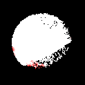

# LENS: A LEO Satellite Network Measurement Dataset

This repository contains the dataset for the submission ***LENS: A LEO Satellite Network Measurement Dataset*** to ACM MMSys'24 Open-source Software and Dataset track.

For ***inside-out*** measurements, the datasets are collected with multiple dishes located in the following regions.

## Dish Locations

| ID                |  Location              | Dish Generation     | Point-of-Presence | Service Tier          |
| ----------------- | ---------------------- | ------------------- | ----------------- | --------------------- |
| victoria_active_1 |  Victoria, BC, Canada  | rev3_proto2         | Seattle           | Standard              |
| victoria_active_2 |  Victoria, BC, Canada  | rev3_proto2         | Seattle           | Mobile                |
| victoria_inactive |  Victoria, BC, Canada  | rev3_proto2         | Seattle           | Inactive Mobile, Roam |
| vancouver         |  Vancouver, BC, Canada | rev2_proto3         | Seattle           | Standard              |
| seattle           |  Seattle, WA, USA      | rev3_proto2         | Seattle           | Standard              |
| seattle_hp        |  Seattle, WA, USA      | hp1_proto1          | Seattle           | High Performance      |
| alaska            |  Anchorage, AK, USA    | rev3_proto2         | Seattle           | Mobile                |
| ottawa            |  Ottawa, ON, Canada    | rev3_proto2         | New York          | Standard              |
| iowa              |  Iowa City, IA, USA    | rev1_pre_production | Chicago           | Standard              |
| denver            |  Denver, CO, USA       | rev3_proto2         | Denver            | Mobile, Roam          |
| dallas            |  Oxford, MS, USA       | rev3_proto2         | Dallas            | Inactive Standard     |
| louvain           |  Louvain, Belgium      | rev3_proto2         | Frankfurt         | Standard              |
| seychelles        |  Seychelles            | rev3_proto2         | Lagos / Frankfurt | Mobile, Roam          |

## Dish Obstruction Maps

| **victoria_active_1**                | **victoria_active_2**                | **victoria_inactive**                |
| ------------------------------------ | ------------------------------------ | ------------------------------------ | 
|  |  |  |
| **vancouver**                        | **seattle**                          | **seattle_hp**                       |
|          |            |         |
| **alaska**                           | **ottawa**                           | **iowa**                             |
|             |             |               |
| **denver**                           | **dallas**                           | **louvain**                          |                                   
|             |             |            |
| **seychelles**                       |                                      |                                      |
|         |                                      |                                      |
  
## Dataset

The dataset is split into monthly snapshots. Each can be retrieved from Zenodo using the links below.

| Monthly Snapshots | Type | Link                                                                                     | Compressed Size | Decompressed Size |
|-------------------|------|------------------------------------------------------------------------------------------|-----------------|-------------------|
| 2024-01           | RAW  | [Part1](https://zenodo.org/records/10445958), [Part2](), [Part3](), [Part4](), [Part5]() |                 | 2.1TB             |
| 2023-12           | RAW  | [Zenodo](https://zenodo.org/records/10608436)                                            |                 | 1.6TB             |
| 2023-11           | RAW  | [Zenodo](https://zenodo.org/records/10608442)                                            |                 | 854GB             |

### Decompress Guide

Due to the file size limit on Zenodo, monthly snapshots are created in splitted tar archives using the following command.

e.g.,
```bash
tar -I "zstd -T24 -8" -cvf - LENS-2024-01 | split --bytes=40GB - LENS-2024-01.tar.zst.
```

To decompress, make sure [Zstd](https://github.com/facebook/zstd) is installed. Download all the splitted tar archives in the same folder, and decompress using the following command. Make sure you have enough disk space. 

e.g.,
```bash
cat LENS-2024-01.tar.zst.* | tar --zstd -xf -
```

We plan to release pre-processed snapshots with latency metrics only in `.csv` format and InfluxDB database dumps in the future.
